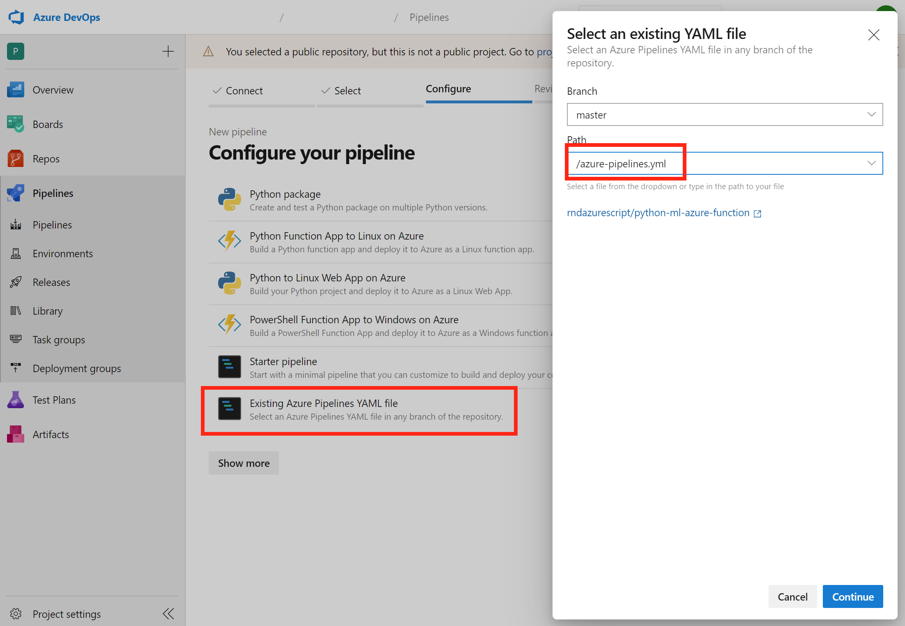
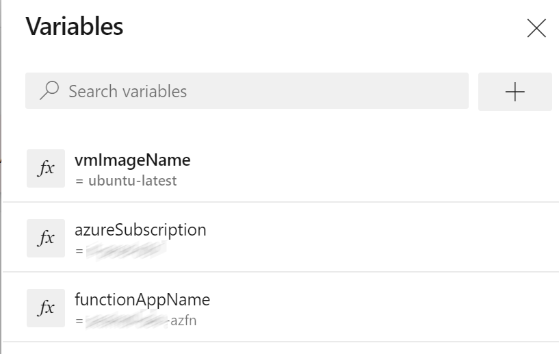

# Python Computer Vision Model in Azure Functions

A python based computer vision model hosted in Azure Functions.

The python codebase is created from the [Make machine learning predictions with TensorFlow and Azure Functions](https://docs.microsoft.com/azure/azure-functions/functions-machine-learning-tensorflow?WT.mc_id=functionspython-github-antchu). 

- '__app__': Contains the python codebase
- 'client': Sample app to invoke the local running azure function.
- 'IaC': Contains ARM deployment template
- 'azure-pipelines.yml': Package and release pipeline
- 'Enable-LongPathSupport.ps1': Enables long path support on windows, as described in the reference article.

## Deploy azure resources

[](https://portal.azure.com/#create/Microsoft.Template/uri/https%3A%2F%2Fraw.githubusercontent.com%2Frndazurescript%2Fpython-ml-azure-function%2Fmaster%2FIaC%2Fazure-function.deploy.json)

## Run local

On a windows pc with conda installed:

``` cmd
cd __app__
conda create -n venv python=3.7
activate venv
pip install --no-cache-dir -r requirements.txt
func start
```

Use the following test urls:
- http://localhost:7071/api/classify?img=https://raw.githubusercontent.com/Azure-Samples/functions-python-tensorflow-tutorial/master/resources/assets/samples/cat1.png
- http://localhost:7071/api/classify?img=https://raw.githubusercontent.com/Azure-Samples/functions-python-tensorflow-tutorial/master/resources/assets/samples/cat2.png
- http://localhost:7071/api/classify?img=https://raw.githubusercontent.com/Azure-Samples/functions-python-tensorflow-tutorial/master/resources/assets/samples/dog1.png
- http://localhost:7071/api/classify?img=https://raw.githubusercontent.com/Azure-Samples/functions-python-tensorflow-tutorial/master/resources/assets/samples/dog2.png

Optionally start the client and use the same github urls.

## Create Azure DevOps pipeline

Register an Azure DevOps pipeline using the azure-pipelines.yml in the root of this repo:



Specify the following variables:
- azureSubscription: The Azure DevOps Resource Manager connection to use for deployment.
- functionAppName: The Azure Function App to deploy the model to.
- vmImageName: Use `ubuntu-latest` or `windows-latest`.

